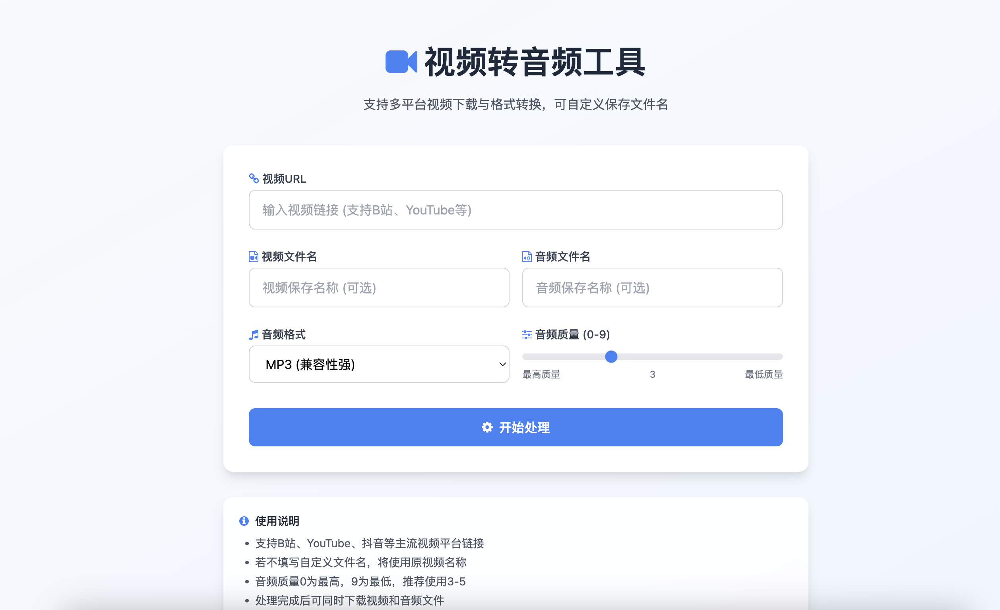

# 视频转音频工具（Video to Audio Converter）

一个支持多平台视频下载、视频转音频的在线工具，可单独下载视频或转换为多种音频格式。

## 核心功能
### 1. 视频下载能力
- 基于 you-get 工具，支持 B 站、YouTube、抖音等多平台视频下载（完整支持列表可参考 [you-get 官方文档](https://you-get.org/#supported-sites)）
- 支持单独下载视频文件（无需转换音频），保留原视频格式
- 可自定义视频保存文件名，支持中文及特殊字符
- 实时显示下载进度，避免用户因无反馈而误操作

### 2. 音频转换能力
- 支持将视频转换为四种主流音频格式：
  - MP3：体积小、兼容性强，适合手机和通用播放器
  - WAV：无损音质、体积较大，适合音频编辑场景
  - M4A：音质优于同体积 MP3，适合苹果设备（iPhone/iPad）
  - FLAC：无损压缩格式，体积小于 WAV，适合无损音乐收藏
- 可调节音频质量（0-9 级，**0 为最高质量，9 为最低质量**）：
  - 0-2 级：高保真需求（如音乐收藏，比特率 320kbps+）
  - 3-5 级：日常使用（平衡音质与体积，比特率 128-256kbps）
  - 6-9 级：低带宽或存储空间有限时使用（比特率 64-128kbps）
- 支持自定义音频保存文件名，转换后直接生效

### 3. 用户体验优化
- 新增实时进度条：直观展示"准备中→视频下载→音频转换→完成"全流程进度
- 简洁美观的卡片式界面，响应式设计适配手机/电脑等不同设备
- 异步处理机制，任务执行时不阻塞用户其他操作
- 处理完成后同时提供"视频下载"和"音频下载"按钮，按需选择
- 清晰的状态提示（成功/失败原因），便于问题排查

## 安装步骤
### 1. 检查前提条件
确保设备已安装以下工具，可通过对应命令验证安装状态：

| 工具         | 最低版本要求 | 验证安装命令       | 说明                     |
|--------------|--------------|--------------------|--------------------------|
| Python       | 3.6+         | `python --version`  | 需显示 `Python 3.6.x` 及以上版本 |
| pip          | 随 Python 自带 | `pip --version`     | 通常 Python 3.4+ 已内置   |
| ffmpeg       | 无明确要求   | `ffmpeg -version`   | 需能正常输出版本信息     |
| you-get      | 无明确要求   | `you-get --version` | 需能正常输出版本信息     |

### 2. 分步安装依赖
#### （1）安装 ffmpeg
- **macOS**（需先安装 [Homebrew](https://brew.sh/)）：
  ```bash
  brew install ffmpeg
  ```
- **Windows**：
  1. 从 [ffmpeg 官网](https://ffmpeg.org/download.html#build-windows) 下载"Full Build"压缩包
  2. 解压到任意目录（如 `C:\ffmpeg`）
  3. 将 `C:\ffmpeg\bin` 添加到系统环境变量（需重启命令行生效）
- **Linux（Ubuntu/Debian）**：
  ```bash
  sudo apt update && sudo apt install ffmpeg
  ```

#### （2）安装 you-get
```bash
pip install you-get
# 如需更新到最新版本：
# pip install --upgrade you-get
```

#### （3）安装 Python 依赖
```bash
pip install flask
```

### 3. 下载项目代码
```bash
# 克隆项目到本地（将 yourusername 替换为实际 GitHub 用户名）
git clone https://github.com/yourusername/music_downloading.git
# 进入项目目录（后续命令需在此目录执行）
cd music_downloading
```

## 使用方法
1. 启动应用程序：
   ```bash
   python app.py
   ```
2. 在浏览器中访问本地服务：
   ```
   http://127.0.0.1:5000
   ```
3. 在网页界面中完成以下操作：
   - 输入视频 URL（支持 B 站等多个平台，需确保链接可正常访问）
   - （可选）自定义视频文件名（不填则使用默认名称，无需输入格式后缀）
   - （可选）自定义音频文件名（不填则使用默认名称，无需输入格式后缀）
   - 选择目标音频格式（MP3、WAV、M4A、FLAC）
   - 拖动滑块选择音频质量（0-9，0 为最高质量）
   - 点击"开始处理"按钮，等待进度条完成（100%即处理结束）
4. 处理完成后：
   - 点击“下载视频”获取原视频文件
   - 点击“下载音频”获取转换后的音频文件

## 项目结构说明
```
├── app.py          # 后端核心文件：处理HTTP请求、进度跟踪、调用you-get和ffmpeg
├── templates/      # 前端页面目录：存放HTML模板文件
│   └── index.html  # 主页面：包含输入表单、进度条和下载按钮
└── tmp/           # 临时文件目录：存储下载的视频和转换后的音频（可手动清理）
```

## 技术栈详情
- **后端框架**：Python Flask（轻量级Web框架，处理请求与业务逻辑）
- **前端技术**：HTML、Tailwind CSS（样式美化）、JavaScript（进度更新与交互）
- **视频处理**：you-get（解析并下载网络视频资源）
- **音频转换**：ffmpeg（专业音视频处理工具，实现格式转换与质量调整）

## 注意事项
1. **使用范围限制**：本工具仅用于个人学习和研究，严禁用于下载、传播受版权保护的内容（如电影、付费课程），违规使用可能面临法律责任
2. **文件管理**：tmp目录会同时留存下载的视频和转换后的音频文件，视频文件通常体积较大，处理后建议及时手动清理，避免占用过多磁盘空间
3. **性能提示**：
   - 视频文件越大，下载和处理时间越长（1GB视频可能需要5-10分钟，取决于设备性能）
   - 期间请勿关闭命令行或浏览器，否则会中断处理
4. **文件大小限制**：默认最大支持50MB的视频文件（视频和音频均适用），若需调整，可修改app.py中`MAX_CONTENT_LENGTH = 50 * 1024 * 1024`（单位：字节）

## 常见问题（FAQ）
1. **Q：音频质量数值为什么越大质量越低？**  
   A：这是遵循ffmpeg工具的参数规范，0代表最低压缩率（保留最多细节），9代表最高压缩率（为减小体积会丢弃更多音频信息），与行业内“质量等级”的常见约定一致。

2. **Q：自定义文件名后下载的文件没有格式后缀？**  
   A：工具会自动添加正确的格式后缀（如视频原格式、选择的音频格式），无需手动输入（例如输入“我的音乐”会自动生成“我的音乐.mp3”）。

3. **Q：进度条卡在某个百分比不动了？**  
   A：可能是网络中断或视频文件过大，可尝试：① 检查网络连接；② 刷新页面重新提交；③ 选择体积较小的视频测试。

4. **Q：如何仅下载视频而不转换音频？**  
   A：无需额外操作，工具会自动同时处理视频下载和音频转换，完成后仅点击“下载视频”即可，音频文件可忽略。

## 许可证
本项目基于[MIT许可证](https://opensource.org/licenses/MIT)开源，你可自由使用、修改、分发本项目代码，但需保留原作者版权声明，且不得用于商业盈利目的（除非获得额外授权）。
